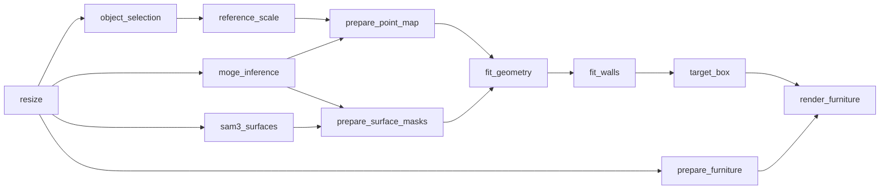

# dreamroom

Furniture replacement pipeline with dependency-based concurrent execution.

- **Resize** — resize the input so its longest side is 1280 px.
- **Object selection** — draw polylines in an OpenCV window, segment
  with a local [SimpleClick](https://github.com/uncbiag/SimpleClick) model
  (ViT-Huge, CoCo+LVIS checkpoint), confirm the mask.
- **Reference scale** — draw a reference line on an object of known length and enter
  its length in meters to get a px-per-meter scale.
- **MoGe inference** — send the working image to the MoGe-2 API and receive a point
  map and metadata, plus optional debug assets.
- **Surface segmentation** — upload the working image once to fal.ai and use SAM 3 text
  prompts to segment wall, floor, and rug pixels.
- **Geometry fitting** — map the SAM-selected floor+rug pixels into 3D, fit the floor,
  and generate a floor-aligned object box.
- **Wall fitting** — map SAM-selected wall pixels into 3D and fit finite vertical,
  floor-anchored wall planes.
- **Target box** — infer a geometry-only placement orientation from the old box
  and walls, then optionally construct a floor-contact replacement box.
- **Render** — draw the target box on the room image, resize the furniture
  reference to max-side 512, and render the replacement with Seedream 5.0 Pro.

After resize, MoGe inference, SAM 3 segmentation, and furniture preprocessing
start concurrently while object selection and reference input remain on the
main thread. Downstream tasks start as soon as their dependencies finish:



API calls are launched before user confirmation to minimize critical-path
latency. Aborting the UI requests best-effort cancellation, but an already
running provider request may still complete and incur usage.

## Project layout

```text
dreamroom/
├── dreamroom/              # the package
│   ├── config.py           # Settings (paths, thresholds, sizes)
│   ├── image_ops.py        # image load / resize / save
│   ├── segmenter.py        # local SimpleClick port (from simpleclick-modal)
│   ├── sam3_client.py      # fal.ai upload + SAM 3 text segmentation
│   ├── surface_viz.py      # separate SAM surface-mask diagnostics
│   ├── geometry3d.py       # floor plane and 3D box fitting
│   ├── wall_geometry.py    # segmented wall-plane fitting
│   ├── placement_geometry.py # placement orientation and target box
│   ├── placement_viz.py    # separate placement debug image and GLB
│   ├── render_viz.py       # red target-box input image
│   ├── seedream_client.py  # BytePlus ModelArk render client
│   ├── moge_client.py      # MoGe-2 API client and response parser
│   ├── pipeline/            # task graph, shared context, timing, and outputs
│   │   ├── __init__.py      # FurniturePipeline facade
│   │   ├── models.py        # shared pipeline context/result models
│   │   ├── outputs.py       # output artifact persistence
│   │   └── stages/          # one module per pipeline stage
│   ├── viz3d.py             # geometry overlays and calibrated GLB export
│   └── ui/
│       ├── window.py       # shared OpenCV window base class
│       ├── strokes.py      # polylines -> segment -> confirm
│       └── reference.py    # reference line -> length in meters
├── scripts/
│   ├── setup_simpleclick.sh      # clone repo + install deps + download weights
│   ├── run_pipeline.py           # CLI entry point
│   └── smoke_test_segmenter.py   # non-interactive segmenter test
├── third_party/SimpleClick # cloned by setup (gitignored)
├── weights/                # checkpoint (gitignored)
└── outputs/                # per-run results (gitignored)
```

## Setup

```bash
python3.10 -m venv .venv
.venv/bin/pip install -r requirements.txt
bash scripts/setup_simpleclick.sh   # clones SimpleClick, installs mmcv, downloads ~2.7 GB weights
export FAL_KEY="your-fal-api-key"
export ARK_API_KEY="your-byteplus-modelark-api-key"
```

The checkpoint download can also be run directly:

```bash
.venv/bin/gdown 1GXk6q5fwKo2twkY5ZZGjVKCgJv7XeLAW -O weights/cocolvis_vit_huge.pth
```

## Run

```bash
.venv/bin/python scripts/run_pipeline.py --image path/to/room.jpg
```

To construct a replacement box, provide all three dimensions in meters:

```bash
.venv/bin/python scripts/run_pipeline.py \
  --image path/to/room.jpg \
  --new-dimensions 1.8 0.9 0.8 \
  --furniture path/to/new-furniture.jpg \
  --debug
```

Options: `--output-dir`, `--max-side`, `--threshold`, `--max-display-width`,
`--no-flip` (about 2x faster segmentation on CPU, slightly lower quality),
`--moge-endpoint`, `--moge-timeout`, `--sam3-model`, `--sam3-timeout`,
`--sam3-min-score`, `--new-dimensions WIDTH DEPTH HEIGHT`, `--debug`,
`--furniture`, `--seedream-endpoint`, `--seedream-model`,
`--seedream-timeout`, and `--skip-moge` (run only steps 0-2). Seedream settings
can also be overridden with `DREAMROOM_SEEDREAM_ENDPOINT` and
`DREAMROOM_SEEDREAM_MODEL`.

### Object selection controls

| Input | Action |
| --- | --- |
| left-drag | positive stroke (red, on the object) |
| right-drag | negative stroke (blue, on the background) |
| `u` / `c` | undo last stroke / clear all strokes |
| Enter / Space | close the annotation window and run segmentation, then open the confirmation view |
| `y` / Enter | confirm the mask in the confirmation view |
| `n` / `r` | redraw the strokes in a new annotation view |
| Esc / `q` | abort |

### Reference controls

| Input | Action |
| --- | --- |
| console input | enter the known reference length in meters before the window opens |
| left-drag | draw the reference line (yellow) |
| Enter | confirm the drawn line |
| `u` / `c` | redraw the line |
| Esc / `q` | abort |

### MoGe-2

The client sends a multipart `POST /predict` request. Production mode is the
default and requests `include_mesh=false` and `include_debug=false` to reduce
latency. Use `--debug` to request both flags as `true`, persist the full MoGe
asset set, and generate `debug_3d.glb`. The endpoint can be overridden with
`--moge-endpoint` or `DREAMROOM_MOGE_ENDPOINT`.

MoGe-2 currently clamps the API input to a maximum side of 800 px, while the
working image defaults to 1280 px. The confirmed mask is therefore resized
down to the returned point-map resolution with nearest-neighbor interpolation
before 3D fitting. Point-map coordinates follow the GLB camera convention:
`+X` right, `+Y` up, and `-Z` forward; normalized intrinsics are stored in the
returned metadata.

### SAM 3 room surfaces

- The client uploads the resized working image once with
  `fal_client.upload_file(...)` and reuses the returned URL.
- Three concurrent requests to
  [`fal-ai/sam-3/image`](https://fal.ai/models/fal-ai/sam-3/image/api) use the
  text prompts `wall`, `floor`, and `rug`.
- Requests return separate binary masks with scores and boxes. Masks below
  `--sam3-min-score` are discarded and accepted masks are resized to point-map
  resolution with nearest-neighbor interpolation.
- `FAL_KEY` is required. The model ID can be overridden with `--sam3-model` or
  `DREAMROOM_SAM3_MODEL`.
- In debug mode, the raw semantic evidence is written separately from the
  geometry overlays as `debug_surfaces_2d.png` and three combined mask images.

### Segmented floor to 3D box

- Reference-line endpoints are sampled in the point map and used to convert
  MoGe units to meters.
- Valid masked points are extracted with light erosion and radial outlier
  clipping.
- Only points selected by the union of the SAM floor and rug masks are used
  for constrained RANSAC floor-plane fitting. Selected-object pixels are
  excluded. If the floor cannot be recovered, a camera-up fallback plane is
  used and marked in the output.
- Object points are transformed into the floor frame. A minimum-area 2D
  footprint and robust height percentile produce the oriented box.
- In `--debug` mode, `debug_3d.glb` scales the original MoGe scene with the
  reference calibration factor before adding the fitted box and floor plane,
  keeping all displayed geometry in calibrated metric coordinates.

### Segmented wall planes

- Wall candidates come only from SAM wall masks; the selected object and points
  too close to or too far above the floor are excluded.
- Vertical 3D wall fitting is reduced to line RANSAC in the fitted floor frame.
  Each SAM instance can produce up to two planes and each result is refined
  with total least squares.
- Small or scattered models are rejected by global inlier ratio, connected
  image-space occupancy, confidence, and scene-relative wall height.
- Nearby parallel layers are compared by support so furniture or wall-adjacent
  surfaces do not become duplicate room walls; close coplanar results are merged.
- Every accepted wall is saved as an infinite plane plus a finite quadrilateral
  whose lower edge is snapped to the floor. With `--debug`, those patches are
  drawn in `debug_2d.png` and inserted into `debug_3d.glb`.

### Placement orientation and target box

- The four vertical faces of the old box are scored against every finite wall
  using distance, plane parallelism, outward direction, and horizontal overlap.
- The result is classified as `wall_backed`, `corner_backed`,
  `angled_wall_backed`, `free_standing`, or `ambiguous`. Corner placement keeps
  a secondary face/wall constraint rather than inventing one semantic rear.
- When wall evidence is weak, visible object-point support provides a cautious
  free-standing fallback. Ambiguous evidence remains explicitly unresolved.
- If replacement dimensions are supplied, the old rear-face bottom midpoint is
  used as the anchor. Alignment under 10 degrees snaps the target rear face
  parallel to its wall; larger tilts preserve the old orientation.
- The target base is constructed at zero signed distance from the fitted floor.
  Corner placement also preserves the old secondary-wall clearance.
- Ambiguous placement keeps the old horizontal axes and footprint center, and
  marks the result as `center_fallback` instead of claiming a rear face.
- Placement visuals use clean, separate `debug_placement_2d.png` and
  `debug_placement_3d.glb` files instead of adding more overlays to the existing
  geometry debug assets.

### Seedream render

- `--furniture` requires all three replacement dimensions. The furniture image
  is loaded locally and resized to max-side 512 with aspect ratio preserved.
- A clean copy of the working room image receives the fitted target box as a
  red 3D wireframe projected with the MoGe camera intrinsics.
- Seedream receives exactly two independent image inputs: Image 1 is the room
  with the red guide box, and Image 2 is the furniture reference. They are not
  stitched or composited together.
- The default request uses `dola-seedream-5-0-pro-260628`, AP Southeast,
  `size=1K`, `response_format=url`, `output_format=jpeg`, watermark disabled,
  and `optimize_prompt_options.mode=fast` for lower latency. `ARK_API_KEY` is
  required.
- The prompt instructs Seedream to replace only the old furniture, match the
  target box dimensions/perspective/floor contact, preserve the room, and
  remove the red guide box from the final image.

## Outputs

Each run writes `outputs/<image-name>-<timestamp>/`:

- `image.png` — the resized (max-side 1280) working image.
- `mask.png` — confirmed object mask (`255` = object).
- `overlay.png` — mask preview over the image.
- `selection.json` — click points used and mask area.
- `reference.json` — reference line endpoints, pixel length, meters, px/m.
- `meta.json` — sizes, resize scale (`original_coord = resized_coord * resize_scale`), settings.
- `point_map.npy` — MoGe point map at the API response resolution (debug mode).
- `output.glb` — original MoGe textured scene in native MoGe coordinates (debug mode).
- `moge_metadata.json` — point-map size, camera convention, and normalized intrinsics (debug mode).
- `depth.png` / `normal.png` — MoGe debug previews (debug mode).
- `box3d.json` — calibrated box center, axes, extents, corners, floor plane, and scale correction.
- `walls3d.json` — detected wall planes, finite corners, support, residual, and confidence.
- `surfaces.json` — SAM 3 prompts, accepted mask scores, boxes, and areas.
- `sam3_floor_mask.png` / `sam3_rug_mask.png` / `sam3_wall_mask.png` — combined semantic masks (debug mode).
- `debug_surfaces_2d.png` — clean SAM surface-mask overlay (debug mode).
- `placement.json` — placement mode, selected faces/walls, confidence, and per-face evidence.
- `target_box3d.json` — replacement box and placement diagnostics when dimensions were supplied.
- `render_room_target_box.png` — room input with the red target-box guide (debug).
- `render_furniture_reference.png` — resized furniture input (max-side 512, debug).
- `rendered_furniture.jpg` — downloaded Seedream output. In production rendering
  mode (without `--debug`), this is the only file written to the output folder.
- `render.json` — Seedream URL, timing, usage, prompt, and input metadata (debug).
- `debug_2d.png` — fitted geometry reprojected onto the working image; wall overlays are debug-only.
- `debug_3d.glb` — calibrated MoGe scene with box, floor, and wall overlays (debug mode).
- `debug_placement_2d.png` — clean face evidence and target-box overlay (debug mode).
- `debug_placement_3d.glb` — clean placement-orientation scene (debug mode).
- `stats.json` — per-task durations, dependency/timeline metadata, critical-path
  estimate, concurrency savings, output-save time, and total runtime (debug or
  non-rendering runs).

The CLI also prints the latency and concurrency summary after the output
directory is written. MoGe-dependent tasks are reported as `skipped` when
`--skip-moge` is used.

## Notes

- The checkpoint is loaded with `torch.load(..., mmap=True)` to keep peak RAM
  near the model size (~2.7 GB). On machines with 8 GB RAM, close heavy apps
  before running; a standard load peaks above 5 GB and can be OOM-killed.
- Measured on a CPU-only 8 GB machine: model load ~1-2 min (one-time per
  process), first segmentation ~38 s, subsequent segmentations on the same
  image ~18 s (image features are cached). Use `--no-flip` to roughly halve
  segmentation time. CUDA is used automatically when available.
- SimpleClick compiles a small Cython extension on first model load; this is
  normal and happens once (cached in `~/.pyxbld`).
- Paths can be overridden with `DREAMROOM_SIMPLECLICK_ROOT` and
  `DREAMROOM_CHECKPOINT`.
- MoGe can be skipped with `--skip-moge`, which is useful for validating the
  interactive object-selection and reference flow without the APIs.

## Test

```bash
.venv/bin/python scripts/smoke_test_segmenter.py
.venv/bin/python -m pytest -q tests
```
