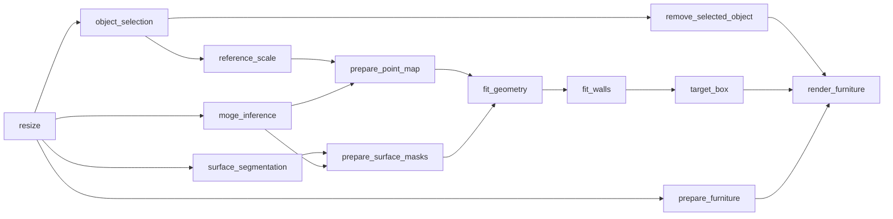

# dreamroom

Furniture replacement pipeline with dependency-based concurrent execution.

- **Resize** — resize the input so its longest side is 1280 px.
- **Object selection** — draw polylines in an OpenCV window, segment
  with the deployed [SimpleClick](https://github.com/uncbiag/SimpleClick) service,
  confirm the mask.
- **Reference scale** — draw a reference line on an object of known length and enter
  its length in meters to get a px-per-meter scale.
- **MoGe inference** — send the working image to the MoGe-2 API and receive a point
  map and metadata, plus optional debug assets.
- **Surface segmentation** — use a deployed OneFormer semantic model first, then
  SAM 3 text prompts, to segment wall, floor, and rug pixels.
- **Geometry fitting** — map the selected floor+rug pixels into 3D, fit the floor,
  and generate a floor-aligned object box.
- **Wall fitting** — map selected wall pixels into 3D and fit finite vertical,
  floor-anchored wall planes.
- **Target box** — infer a geometry-only placement orientation from the old box
  and walls, then optionally construct a floor-contact replacement box.
- **Render** — remove the selected object from an unpadded square crop with
  Gemini Nano Banana Lite through fal.ai, stitch that patch back into the room,
  draw the target box, resize the furniture reference to max-side 512, and
  render the replacement with Seedream 5.0 Pro.

After resize, MoGe inference, OneFormer/SAM3 segmentation, and furniture preprocessing
start concurrently while object selection and reference input remain on the
main thread. Downstream tasks start as soon as their dependencies finish:



MoGe and room-surface API calls are launched before user confirmation to
minimize critical-path latency. Gemini removal starts immediately after the
selection is confirmed and overlaps reference-scale and geometry preparation.
Aborting the UI requests best-effort cancellation, but an already running
provider request may still complete and incur usage.

## Project layout

```text
dreamroom/
├── dreamroom/              # the package
│   ├── config.py           # Settings (paths, thresholds, sizes)
│   ├── image_ops.py        # image load / resize / save
│   ├── segmenter.py        # remote SimpleClick client
│   ├── oneformer_client.py # remote OneFormer semantic segmentation client
│   ├── sam3_client.py      # fal.ai upload + SAM 3 text segmentation fallback
│   ├── surface_viz.py      # separate SAM surface-mask diagnostics
│   ├── geometry3d.py       # floor plane and 3D box fitting
│   ├── wall_geometry.py    # segmented wall-plane fitting
│   ├── placement_geometry.py # placement orientation and target box
│   ├── placement_viz.py    # separate placement debug image and GLB
│   ├── render_viz.py       # red target-box input image
│   ├── object_removal.py   # square crop and patch stitch helpers
│   ├── gemini_client.py    # fal.ai Gemini Nano Banana Lite edit client
│   ├── seedream_client.py  # BytePlus ModelArk render client
│   ├── moge_client.py      # MoGe-2 API client and response parser
│   ├── pipeline/            # task graph, shared context, timing, and outputs
│   │   ├── __init__.py      # FurniturePipeline facade
│   │   ├── models.py        # shared pipeline context/result models
│   │   ├── outputs.py       # output artifact persistence
│   │   └── stages/          # one module per pipeline stage
│   ├── viz3d.py             # geometry overlays and calibrated GLB export
│   └── ui/
│       ├── window.py       # shared OpenCV window base class
│       ├── strokes.py      # polylines -> segment -> confirm
│       └── reference.py    # reference line -> length in meters
├── scripts/
│   ├── run_pipeline.py           # CLI entry point
│   └── smoke_test_segmenter.py   # remote segmentation smoke test
├── third_party/            # optional Modal deployment sources
└── outputs/                # per-run results (gitignored)
```

## Setup

```bash
python3.10 -m venv .venv
.venv/bin/pip install -r requirements.txt
export DREAMROOM_SIMPLECLICK_ENDPOINT="https://blakestieper--simpleclick-interactive-segmentation-simpl-771f03.modal.run"
export DREAMROOM_MOGE_ENDPOINT="https://blakestieper--moge-2-api-web.modal.run"
export DREAMROOM_ONEFORMER_ENDPOINT="https://<your-oneformer-modal-app>.modal.run"
export FAL_KEY="your-fal-api-key"
export ARK_API_KEY="your-byteplus-modelark-api-key"
```

## Run

```bash
.venv/bin/python scripts/run_pipeline.py --image path/to/room.jpg
```

To construct a replacement box, provide all three dimensions in meters:

```bash
.venv/bin/python scripts/run_pipeline.py \
  --image path/to/room.jpg \
  --new-dimensions 1.8 0.9 0.8 \
  --furniture path/to/new-furniture.jpg \
  --debug
```

Options: `--output-dir`, `--max-side`, `--threshold`, `--max-display-width`,
`--moge-endpoint`, `--moge-timeout`, `--sam3-model`, `--sam3-timeout`,
`--sam3-min-score`, `--new-dimensions WIDTH DEPTH HEIGHT`, `--debug`,
`--furniture`, `--seedream-endpoint`, `--seedream-model`,
`--seedream-timeout`, `--gemini-model`, `--gemini-timeout`, and `--skip-moge`
(run only the interactive selection and reference flow). Seedream settings
can also be overridden with `DREAMROOM_SEEDREAM_ENDPOINT` and
`DREAMROOM_SEEDREAM_MODEL`.

### Object selection controls

| Input | Action |
| --- | --- |
| left-drag | positive stroke (red, on the object) |
| right-drag | negative stroke (blue, on the background) |
| `u` / `c` | undo last stroke / clear all strokes |
| Enter / Space | close the annotation window and run segmentation, then open the confirmation view |
| `y` / Enter | confirm the mask in the confirmation view |
| `n` / `r` | redraw the strokes in a new annotation view |
| Esc / `q` | abort |

### Reference controls

| Input | Action |
| --- | --- |
| console input | enter the known reference length in meters before the window opens |
| left-drag | draw the reference line (yellow) |
| Enter | confirm the drawn line |
| `u` / `c` | redraw the line |
| Esc / `q` | abort |

### MoGe-2

The client sends a multipart `POST /predict` request. Production mode is the
default and requests `include_mesh=false` and `include_debug=false` to reduce
latency. Use `--debug` to request both flags as `true`, persist the full MoGe
asset set, and generate `debug_3d.glb`. The endpoint can be overridden with
`--moge-endpoint` or `DREAMROOM_MOGE_ENDPOINT`.

Object segmentation uses the remote SimpleClick endpoint configured by
`DREAMROOM_SIMPLECLICK_ENDPOINT`. The default is the deployed Modal service
shown in the Setup section. Each request sends the working RGB image as a
base64 PNG together with sampled positive/negative stroke points and receives
a base64 PNG mask.

MoGe-2 currently clamps the API input to a maximum side of 800 px, while the
working image defaults to 1280 px. The confirmed mask is therefore resized
down to the returned point-map resolution with nearest-neighbor interpolation
before 3D fitting. Point-map coordinates follow the GLB camera convention:
`+X` right, `+Y` up, and `-Z` forward; normalized intrinsics are stored in the
returned metadata.

### OneFormer → SAM 3 room surfaces

- The client first calls `DREAMROOM_ONEFORMER_ENDPOINT`, a Modal endpoint
  running `shi-labs/oneformer_ade20k_swin_large` through Transformers semantic
  segmentation. It consumes the ADE20K `wall`, `floor`, and `rug` classes.
- If the endpoint is unset, fails, or does not return both wall and floor masks,
  the client falls back to three concurrent requests to
  [`fal-ai/sam-3/image`](https://fal.ai/models/fal-ai/sam-3/image/api) using the
  text prompts `wall`, `floor`, and `rug`.
- OneFormer and SAM3 return separate binary masks. SAM3 masks below
  `--sam3-min-score` are discarded and accepted masks are resized to point-map
  resolution with nearest-neighbor interpolation.
- Set `DREAMROOM_ONEFORMER_ENDPOINT` to the URL printed by `modal deploy`; the
  endpoint is optional so existing SAM3 deployments remain usable. `FAL_KEY` is
  required when SAM3 is reached.
- In debug mode, the raw semantic evidence is written separately from the
  geometry overlays as `debug_surfaces_2d.png` and provider-prefixed mask images.

### Gemini object removal

- Gemini Nano Banana Lite is called through fal.ai using `FAL_KEY`; the model
  defaults to `google/nano-banana-lite/edit` and can be overridden with
  `DREAMROOM_GEMINI_MODEL` or `--gemini-model`.

### Segmented floor to 3D box

- Reference-line endpoints are sampled in the point map and used to convert
  MoGe units to meters.
- Valid masked points are extracted with light erosion and radial outlier
  clipping.
- By default, points selected by the union of the OneFormer or SAM3 floor and rug masks are
  used for constrained RANSAC floor-plane fitting. Selected-object pixels are
  excluded. If OneFormer and SAM3 are unavailable or their fit is too weak, the older manual
  fallback fits RANSAC to non-object points in the bottom half of the image;
  if that also fails, a camera-up plane is used. The selected method is marked
  in `box3d.json` and `walls3d.json` (`sam3`, `manual`, or `camera_up`).
- Object points are transformed into the floor frame. A minimum-area 2D
  footprint and robust height percentile produce the oriented box.
- In `--debug` mode, `debug_3d.glb` scales the original MoGe scene with the
  reference calibration factor before adding the fitted box and floor plane,
  keeping all displayed geometry in calibrated metric coordinates.

### Segmented wall planes

- By default, wall candidates come from OneFormer or SAM3 wall masks; the selected object and
  points too close to or too far above the floor are excluded. If both semantic
  providers are unavailable or produce no accepted wall, the manual fallback runs the
  global point-cloud wall RANSAC from all eligible non-object pixels.
- Vertical 3D wall fitting is reduced to line RANSAC in the fitted floor frame.
  Each SAM instance can produce up to two planes and each result is refined
  with total least squares.
- Small or scattered models are rejected by global inlier ratio, connected
  image-space occupancy, confidence, and scene-relative wall height.
- Nearby parallel layers are compared by support so furniture or wall-adjacent
  surfaces do not become duplicate room walls; close coplanar results are merged.
- Every accepted wall is saved as an infinite plane plus a finite quadrilateral
  whose lower edge is snapped to the floor. With `--debug`, those patches are
  drawn in `debug_2d.png` and inserted into `debug_3d.glb`.

### Placement orientation and target box

- The four vertical faces of the old box are scored against every finite wall
  using distance, plane parallelism, outward direction, and horizontal overlap.
- The result is classified as `wall_backed`, `corner_backed`,
  `angled_wall_backed`, `free_standing`, or `ambiguous`. Corner placement keeps
  a secondary face/wall constraint rather than inventing one semantic rear.
- When wall evidence is weak, visible object-point support provides a cautious
  free-standing fallback. Ambiguous evidence remains explicitly unresolved.
- If replacement dimensions are supplied, the old rear-face bottom midpoint is
  used as the anchor. Alignment under 10 degrees snaps the target rear face
  parallel to its wall; larger tilts preserve the old orientation.
- The target base is constructed at zero signed distance from the fitted floor.
  Corner placement also preserves the old secondary-wall clearance.
- Ambiguous placement keeps the old horizontal axes and footprint center, and
  marks the result as `center_fallback` instead of claiming a rear face.
- Placement visuals use clean, separate `debug_placement_2d.png` and
  `debug_placement_3d.glb` files instead of adding more overlays to the existing
  geometry debug assets.

### Seedream render

- `--furniture` requires all three replacement dimensions. The furniture image
  is loaded locally and resized to max-side 512 with aspect ratio preserved.
- The selected-object region is cropped as a direct slice. It uses a 1:1 crop
  whose edge is the shorter side of the working room image when the selection
  fits; otherwise it chooses the closest supported Gemini aspect ratio from
  the model list. Gemini edits that patch to remove the old object; the result
  is resized back to the exact crop size and stitched into the room before the
  target box is drawn.
- A clean copy of the object-removed room image receives the fitted target box
  as a red 3D wireframe projected with the MoGe camera intrinsics.
- Seedream receives exactly two independent image inputs: Image 1 is the
  object-removed room with the red guide box, and Image 2 is the furniture
  reference. They are not stitched or composited together.
- The default request uses `dola-seedream-5-0-pro-260628`, AP Southeast,
  `size=1K`, `response_format=url`, `output_format=jpeg`, watermark disabled,
  and `optimize_prompt_options.mode=fast` for lower latency. `ARK_API_KEY` is
  required.
- The prompt instructs Seedream to replace only the old furniture, match the
  target box dimensions/perspective/floor contact, preserve the room, and
  remove the red guide box from the final image.

## Outputs

Each run writes `outputs/<image-name>-<timestamp>/`:

- `image.png` — the resized (max-side 1280) working image.
- `mask.png` — confirmed object mask (`255` = object).
- `overlay.png` — mask preview over the image.
- `selection.json` — click points used and mask area.
- `reference.json` — reference line endpoints, pixel length, meters, px/m.
- `meta.json` — sizes, resize scale (`original_coord = resized_coord * resize_scale`), settings.
- `point_map.npy` — MoGe point map at the API response resolution (debug mode).
- `output.glb` — original MoGe textured scene in native MoGe coordinates (debug mode).
- `moge_metadata.json` — point-map size, camera convention, and normalized intrinsics (debug mode).
- `depth.png` / `normal.png` — MoGe debug previews (debug mode).
- `box3d.json` — calibrated box center, axes, extents, corners, floor plane,
  scale correction, and the floor fitting method used.
- `walls3d.json` — detected wall planes, finite corners, support, residual,
  confidence, and the floor/wall fitting methods used (`oneformer`, `sam3`, or
  `manual`).
- `surfaces.json` — provider, model, accepted mask scores, boxes, and areas.
- `<provider>_floor_mask.png` / `<provider>_rug_mask.png` /
  `<provider>_wall_mask.png` — combined semantic masks (debug mode), where
  `<provider>` is `oneformer` or `sam3`.
- `debug_surfaces_2d.png` — clean SAM surface-mask overlay (debug mode).
- `placement.json` — placement mode, selected faces/walls, confidence, and per-face evidence.
- `target_box3d.json` — replacement box and placement diagnostics when dimensions were supplied.
- `render_room_target_box.png` — room input with the red target-box guide (debug).
- `render_furniture_reference.png` — resized furniture input (max-side 512, debug).
- `render_object_removal_input.png` — square crop with the selected-object
  mask/outline sent to Gemini (debug).
- `render_object_removed_patch.png` — Gemini patch resized to the crop size (debug).
- `render_room_object_removed.png` — stitched room before the red target-box guide (debug).
- `rendered_furniture.jpg` — downloaded Seedream output. In production rendering
  mode (without `--debug`), this is the only file written to the output folder.
- `render.json` — Seedream URL, timing, usage, prompt, and input metadata (debug).
- `debug_2d.png` — fitted geometry reprojected onto the working image; wall overlays are debug-only.
- `debug_3d.glb` — calibrated MoGe scene with box, floor, and wall overlays (debug mode).
- `debug_placement_2d.png` — clean face evidence and target-box overlay (debug mode).
- `debug_placement_3d.glb` — clean placement-orientation scene (debug mode).
- `stats.json` — per-task durations, dependency/timeline metadata, critical-path
  estimate, concurrency savings, output-save time, and total runtime (debug or
  non-rendering runs).

The CLI also prints the latency and concurrency summary after the output
directory is written. MoGe-dependent tasks are reported as `skipped` when
`--skip-moge` is used.

## Notes

- SimpleClick and MoGe run as remote Modal services; no local model weights or
  SimpleClick checkout are required.
- The SimpleClick endpoint can be overridden with
  `DREAMROOM_SIMPLECLICK_ENDPOINT`.
- The MoGe endpoint can be overridden with `DREAMROOM_MOGE_ENDPOINT` or the
  `--moge-endpoint` CLI option.
- Deploy `third_party/OneFormer/oneformer_api.py` yourself with Modal and set
  `DREAMROOM_ONEFORMER_ENDPOINT` to its URL. If unset, the pipeline starts with
  SAM3.
- MoGe can be skipped with `--skip-moge`, which is useful for validating the
  interactive object-selection and reference flow without the APIs.

## Test

```bash
.venv/bin/python scripts/smoke_test_segmenter.py  # requires the SimpleClick service
.venv/bin/python -m pytest -q tests
```
